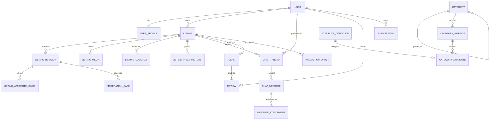

# 3. Каталог и модель данных

## 3.1. Принцип каталога

Каталог — управляемая административная система, а не набор C# enum. Категории, характеристики, варианты значений, обязательность, фильтры и шаблоны сравнения изменяются без выпуска новой версии сайта.

Глубина дерева технически не ограничивается. Для пользовательского интерфейса желательно не превышать 4–5 уровней без необходимости.

## 3.2. Верхнеуровневые разделы

1. Транспорт.
2. Недвижимость.
3. Электроника.
4. Дом, мебель и интерьер.
5. Строительство и ремонт.
6. Сад и дача.
7. Одежда, обувь и аксессуары.
8. Детские товары.
9. Хобби, спорт и развлечения.
10. Животные.
11. Работа.
12. Услуги.
13. Для бизнеса.
14. Обмен и бесплатно — как режим сделки и тематические подборки.
15. Бюро находок.

## 3.3. Базовая структура направлений

### Транспорт

- легковые автомобили;
- мотоциклы и мототехника;
- грузовики;
- спецтехника;
- автобусы;
- прицепы;
- водный транспорт;
- автодома;
- запчасти;
- шины и диски;
- автоэлектроника;
- инструменты и оборудование;
- аксессуары;
- транспорт на разбор;
- транспортные услуги.

### Недвижимость

- квартиры;
- комнаты;
- дома;
- дачи;
- коттеджи;
- таунхаусы;
- участки;
- гаражи;
- машиноместа;
- коммерческая недвижимость;
- склады;
- офисы;
- производственные помещения;
- торговые помещения.

Типы сделки: продажа, долгосрочная аренда, посуточная аренда, новостройка и вторичный рынок — где применимо.

### Электроника

- смартфоны;
- планшеты;
- ноутбуки;
- компьютеры;
- комплектующие;
- мониторы;
- оргтехника;
- сетевое оборудование;
- телевизоры;
- аудио;
- фото и видео;
- игровые приставки и игры;
- умный дом;
- бытовая и климатическая техника;
- аксессуары;
- электронные компоненты.

### Дом и мебель

- мягкая мебель;
- корпусная мебель;
- кухни;
- столы и стулья;
- кровати и матрасы;
- системы хранения;
- освещение;
- текстиль;
- декор;
- посуда;
- товары для кухни;
- бытовые товары;
- уборка;
- безопасность дома.

### Остальные разделы

Остальные глобальные разделы создаются по тому же принципу. Полная глубина должна наращиваться через административную панель и seed-файлы, а не через изменения кода.

## 3.4. Динамические характеристики

Для характеристики задаются:

- технический код;
- локализованное название;
- тип данных;
- обязательность;
- единица измерения;
- минимальное и максимальное значение;
- варианты выбора;
- множественный выбор;
- подсказка;
- порядок;
- участие в поиске;
- участие в фильтрах;
- участие в сравнении;
- показ в карточке;
- показ в списке;
- зависимость от другой характеристики;
- условная обязательность;
- правила валидации;
- чувствительность данных;
- доступность для типа сделки.

Типы:

- string;
- multiline text;
- integer;
- decimal;
- boolean;
- date;
- single select;
- multi select;
- range;
- color;
- size;
- dictionary reference;
- geo point;
- composite value;
- file reference.

## 3.5. Наследование и версии

- Общие характеристики наследуются от родительской категории.
- Дочерняя категория может скрыть или переопределить параметр.
- Каждая опубликованная схема категории имеет версию.
- Объявление хранит идентификатор версии схемы.
- Изменение схемы не ломает старые объявления.
- Миграции значений выполняются отдельными задачами и журналируются.

## 3.6. Примеры характеристик

### Мебель

- ширина;
- высота;
- глубина;
- материал;
- цвет;
- состояние;
- механизм трансформации;
- возможность разборки;
- доставка.

### Ноутбук

- бренд;
- модель;
- процессор;
- оперативная память;
- накопитель;
- видеокарта;
- диагональ;
- разрешение;
- состояние;
- гарантия.

### Автомобиль

- марка;
- модель;
- поколение;
- год;
- пробег;
- двигатель;
- мощность;
- коробка;
- привод;
- кузов;
- владельцы;
- VIN как защищённое поле.

## 3.7. Основные сущности

### Identity и пользователи

- `User`;
- `UserProfile`;
- `UserContact`;
- `UserVerification`;
- `UserSession`;
- `UserRestriction`;
- `Role`;
- `Permission`.

### Каталог

- `Category`;
- `CategoryVersion`;
- `AttributeDefinition`;
- `AttributeOption`;
- `CategoryAttribute`;
- `AttributeDependency`;
- `Dictionary`;
- `DictionaryItem`;
- `ComparisonTemplate`.

### Объявления

- `Listing`;
- `ListingRevision`;
- `ListingAttributeValue`;
- `ListingMedia`;
- `ListingLocation`;
- `PickupPoint`;
- `ListingContactPreference`;
- `ListingStatusHistory`;
- `ListingPriceHistory`;
- `ListingRelation`.

### Поиск и поведение

- `SearchEvent`;
- `ListingViewEvent`;
- `SavedSearch`;
- `RecommendationEvent`;
- `HiddenListing`;
- `HiddenSeller`.

### Коммуникации и сделки

- `ChatThread`;
- `ChatParticipant`;
- `ChatMessage`;
- `MessageAttachment`;
- `MessageStatus`;
- `UserPresence`;
- `UserBlock`;
- `Deal`;
- `DealParticipantConfirmation`;
- `Review`.

### Модерация

- `ModerationCase`;
- `ModerationFinding`;
- `ModerationDecision`;
- `ModerationRule`;
- `ModerationModelVersion`;
- `ModerationAppeal`;
- `Report`;
- `Sanction`;
- `UserRiskProfile`.

### Монетизация

- `Plan`;
- `Entitlement`;
- `Quota`;
- `Subscription`;
- `PromotionProduct`;
- `PromotionOrder`;
- `Payment`;
- `Refund`;
- `PromoCode`;
- `BonusLedgerEntry`.

### Система

- `Notification`;
- `AuditLog`;
- `FeatureFlag`;
- `OutboxMessage`;
- `IntegrationEvent`;
- `BackgroundJobRecord`.

## 3.8. Высокоуровневая ER-схема

## 3.9. Правила хранения значений

- Основной источник истины — PostgreSQL.
- Часто фильтруемые характеристики должны иметь типизированное индексируемое представление.
- JSONB допустим для вспомогательных снимков и редких полей, но не должен заменять всю модель фильтрации.
- Поисковый индекс считается производной моделью и может быть перестроен.
- Публичная ревизия объявления отделяется от новой ревизии, находящейся на модерации.
