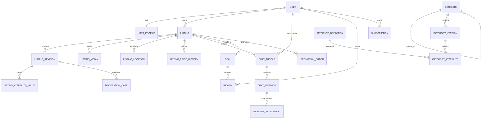

# MASTER SPECIFICATION — Сервис объявлений

> Единая сборка документов. При конфликте приоритет: `00_PROJECT_MANIFEST.yaml`, затем профильный файл.


---

<!-- Source: README.md -->

# Пакет требований к сервису объявлений

Этот каталог — основной референс для проектирования и поэтапной разработки российского сервиса объявлений на ASP.NET Core, C#, Razor и SignalR.

## Как использовать пакет

Codex должен читать документы в указанном порядке и не пытаться реализовать весь продукт одним большим изменением:

1. `00_PROJECT_MANIFEST.yaml` — краткие неизменяемые решения и ограничения.
2. `01_PRODUCT_VISION_AND_SCOPE.md` — видение продукта, аудитория и границы.
3. `02_FUNCTIONAL_REQUIREMENTS.md` — пользовательские сценарии и функции.
4. `03_CATALOG_AND_DATA_MODEL.md` — каталог, атрибуты, сущности и статусы.
5. `04_SEARCH_MAP_RECOMMENDATIONS.md` — поиск, карта и персонализация.
6. `05_MESSAGING_DEALS_REVIEWS.md` — чат, звонки, сделки и отзывы.
7. `06_MODERATION_SAFETY_COMPLIANCE.md` — модерация, безопасность и юридические ограничения.
8. `07_MONETIZATION_ADMIN_ANALYTICS.md` — тарифы, продвижение, роли и аналитика.
9. `08_TECHNICAL_ARCHITECTURE.md` — техническая архитектура.
10. `09_UI_UX_DESIGN_SYSTEM.md` — визуальный язык и интерфейсные правила.
11. `10_INCREMENTAL_DELIVERY_PLAN.md` — обязательная поэтапная разработка с видимым результатом.
12. `11_ACCEPTANCE_AND_TESTING.md` — критерии приёмки и тестирования.
13. `12_CODEX_MASTER_PROMPT.md` — инструкция, которую можно передать Codex.
14. `13_OPEN_DECISIONS_AND_RISKS.md` — нерешённые вопросы и риски.
15. `14_INITIAL_BACKLOG.md` — начальный backlog.

В папке `assets` находятся:

- `design-reference.png` — утверждённое направление дизайна;
- `design-tokens.css` — стартовые CSS-переменные;
- `sample-listings.json` — демонстрационные объявления для первого прототипа.

## Непереговорные правила разработки

1. **После каждого этапа должен быть доступен работающий сайт**, который владелец может открыть, проверить и сравнить с критериями приёмки.
2. Этап нельзя закрывать только потому, что созданы классы, таблицы или API. Должен быть видимый пользовательский сценарий.
3. Каждый этап включает seed-данные, инструкцию запуска и короткий checklist проверки.
4. Не внедрять микросервисы на старте. Использовать модульный монолит с чёткими границами.
5. Не привязывать доменную логику напрямую к Яндекс Картам, платёжному провайдеру, KYC-провайдеру, SMS или почтовому сервису. Все внешние сервисы подключаются через интерфейсы.
6. Платежи, безопасная сделка, доставка и подтверждение личности должны быть выключаемыми feature flags до юридической и коммерческой готовности.
7. Автоматические решения модерации должны быть объяснимыми и сохранять версию правила или модели.
8. Любое изменение объявления, кроме цены, создаёт новую ревизию и повторно проходит модерацию.
9. Изменение категории создаёт новое объявление и архивирует старое.
10. Основной визуальный стиль — тёплый функциональный минимализм, как в `assets/design-reference.png`.

## Рекомендуемый первый запуск Codex

Начать только с этапа `M0 — Bootstrap и живой UI-shell` из `10_INCREMENTAL_DELIVERY_PLAN.md`. После демонстрации и подтверждения владельцем переходить к следующему этапу.


---

<!-- Source: 00_PROJECT_MANIFEST.yaml -->

project:
  working_name: "Marketplace"
  product_type: "Федеральный сервис частных объявлений"
  country: "Россия"
  primary_audience: "Частные лица"
  owner_team:
    - "Владелец проекта"
    - "Codex"
  initial_budget: 0
  first_year_targets:
    registered_users: 1000
    active_listings: 10000

product_principles:
  - "Простой и быстрый сценарий подачи объявления"
  - "Каждое решение модерации имеет понятную причину"
  - "Объявления и фотографии важнее рекламы интерфейса"
  - "Платные услуги не прерывают создание объявления"
  - "После каждого этапа разработки доступен проверяемый сайт"
  - "Мобильное приложение будет позже, API закладывается сразу"

geography:
  coverage: "Вся Россия"
  city_detection_priority:
    - "Сохранённый выбор пользователя"
    - "Геолокация браузера с разрешения"
    - "IP-геолокация"
    - "Москва как fallback"
  default_radius_km: 30
  fallback_scope: "Вся Россия"
  map_provider_preference: "Яндекс Карты"
  exact_address_public_only_with_consent: true
  subway_search: true
  route_search: false
  multiple_pickup_points: true

identity:
  registration_methods:
    - "Email с одноразовым кодом"
    - "Телефон с одноразовым кодом"
  phone_required_for_listing: false
  one_phone_per_account: true
  corporate_shared_accounts: false
  identity_verification_status: true
  child_account_required: true

listings:
  active_days: 30
  free_active_limit: 10
  max_photos: 10
  auto_renew_supported: true
  price_modes:
    - "FIXED"
    - "FREE"
    - "EXCHANGE"
    - "EXCHANGE_WITH_SURCHARGE"
    - "ON_REQUEST_WHERE_ALLOWED"
  auctions: false
  category_change_policy: "Создать новое объявление, архивировать старое, сбросить просмотры и избранное"
  price_change_requires_remoderation: false
  all_other_public_changes_require_remoderation: true

search:
  user_selects_sorting: true
  default_sort: "RECOMMENDED"
  promoted_results: "Отдельный маркированный блок сверху"
  guest_personalization: "Cookie/local identifier с согласием"
  history_retention_days: 30
  personalization_opt_out: true
  image_search_future: true
  llm_query_correction_future: true

messaging:
  conversation_participants: 2
  realtime: "SignalR"
  max_attachment_mb: 20
  external_links_allowed: false
  images_allowed: true
  documents_allowed: true
  voice_messages_future: true
  voice_transcription_future: true
  internet_calls_future: true
  typing_indicator: true
  online_status: true
  message_templates: true
  offline_autoreply: true

moderation:
  automatic_check_always: true
  manual_check_policy: "Обязательно для новых и рискованных публикаций; доверенные низкорисковые могут публиковаться автоматически через feature flag"
  target_first_review_minutes: 60
  appeals_max_business_days: 45
  warnings_default: 3
  severity_overrides_warning_count: true
  retain_evidence: true

monetization:
  free_plan_active_listings: 10
  monthly_subscription_possible: true
  annual_subscription_possible: true
  trial: false
  promo_codes: true
  bonus_discount_system: true
  real_payments_initially_disabled: true
  safe_deal_future: true
  delivery_future: true

technology:
  backend: ".NET / ASP.NET Core / C#"
  ui: "Razor server-rendered UI + TypeScript for interactive areas"
  realtime: "SignalR"
  architecture: "Модульный монолит"
  database: "PostgreSQL + PostGIS"
  cache: "Redis when needed"
  object_storage: "S3-compatible storage"
  search_phase_1: "PostgreSQL full-text + trigram + PostGIS"
  search_phase_2: "OpenSearch when justified"
  hosting_country: "Россия"
  environments:
    - "Development"
    - "Staging"
    - "Production"
  backups: "Ежедневно + point-in-time recovery when production-ready"

visual_design:
  direction: "Тёплый функциональный минимализм"
  base_reference: "assets/design-reference.png"
  light_theme: true
  dark_theme: true
  card_image_ratio: "4:3"
  card_total_visual_ratio: "примерно 3:4"
  border_radius_px: 12
  primary_accent: "тёплый медно-коричневый"
  map_list_linked_hover: true


---

<!-- Source: 01_PRODUCT_VISION_AND_SCOPE.md -->

# 1. Видение продукта и границы

## 1.1. Концепция

Продукт — федеральная российская платформа объявлений для частных лиц. Пользователь может быстро разместить товар, недвижимость, транспорт, услугу, вакансию или другое предложение; покупатель может найти его через каталог, строку поиска, фильтры или карту, связаться через защищённый чат и позднее провести безопасную сделку через площадку.

Платформа должна объединять:

- доску объявлений;
- каталог с динамическими характеристиками;
- географический поиск;
- личные сообщения;
- профили и репутацию;
- автоматическую и ручную модерацию;
- персональные рекомендации;
- платные лимиты и продвижение;
- административные и модераторские инструменты.

## 1.2. Основная аудитория

Первая версия предназначена для частных лиц по всей России. Архитектура должна позволять позже добавить профессиональных продавцов, организации, магазины, сотрудников аккаунта, импорт и партнёрский API.

## 1.3. Основные проблемы, которые продукт должен решить

1. Создание объявления на крупных сервисах часто перегружено дополнительными предложениями и платными опциями.
2. Пользователь не всегда понимает, почему объявление отклонено.
3. Карта и список часто существуют как слабо связанные режимы.
4. Категории и фильтры не всегда соответствуют реальным характеристикам товара.
5. Платное продвижение может визуально смешиваться с органической выдачей.
6. Пользователь хочет безопасно общаться, не раскрывая телефон.

## 1.4. Принципы продукта

### Быстрый путь

Простое объявление должно отправляться на модерацию за три основных шага:

1. Фотографии, название, категория и цена.
2. Описание, характеристики и местоположение.
3. Контакты, предварительный просмотр и публикация.

### Прозрачная модерация

Вместо сообщения «объявление отклонено» пользователь получает:

- конкретную причину;
- проблемный фрагмент;
- правило;
- способ исправления;
- кнопку повторной отправки;
- возможность апелляции.

### Объявления важнее продвижения

Платные услуги не должны появляться в середине мастера создания объявления. Их можно предлагать только после отправки или публикации.

### Отдельность органической и платной выдачи

Продвигаемые объявления отображаются отдельным маркированным блоком. Платная услуга не делает нерелевантный товар органически первым.

### Приватность по умолчанию

Для частного адреса по умолчанию показывается приблизительное положение. Точный адрес раскрывается только по явному согласию продавца.

## 1.5. География

- Работа только в России.
- Запуск по всей стране.
- Объявления доступны независимо от города посетителя.
- Выбранный город влияет на выдачу, радиус и карту, но не ограничивает доступ к другим регионам.
- При первом посещении город определяется по сохранённому выбору, геолокации браузера или IP.
- Автоматическое определение необходимо подтвердить ненавязчивым сообщением: «Ваш город — …?».
- При ошибке определения используется Москва и поиск по всей России.

## 1.6. Что входит в базовый продукт

- регистрация по email или телефону;
- профиль пользователя;
- каталог и подкатегории;
- динамические характеристики;
- объявления с фотографиями, ценой и географией;
- поиск, фильтры и сортировка;
- карта с кластерами;
- чат;
- избранное и сравнение;
- модерация и апелляции;
- административная панель;
- тарифы и продвижение как отключаемый контур;
- API для будущего приложения.

## 1.7. Что закладывается, но не включается в первый публичный релиз

- безопасная сделка;
- доставка;
- интернет-звонки;
- голосовые сообщения и расшифровка;
- сложная ML-персонализация;
- поиск по фотографии;
- полноценный KYC;
- профессиональные продавцы;
- массовый импорт;
- нативные мобильные приложения.

## 1.8. Критерий успеха первого продукта

Пользователь может:

1. Зарегистрироваться.
2. Найти подходящую категорию.
3. Создать объявление.
4. Увидеть статус модерации.
5. Найти опубликованное объявление через поиск и карту.
6. Написать продавцу.
7. Добавить объявление в избранное и сравнение.
8. Управлять своими объявлениями и профилем.

Владелец может:

1. Управлять категориями и характеристиками.
2. Проверять объявления.
3. Видеть причины автоматических срабатываний.
4. Блокировать нарушения.
5. Просматривать аудит действий.
6. Проверять каждый завершённый этап на Staging-сайте.


---

<!-- Source: 02_FUNCTIONAL_REQUIREMENTS.md -->

# 2. Функциональные требования

## 2.1. Роли пользователей

### Гость

- просматривает объявления и профили;
- использует поиск, фильтры и карту;
- видит похожие объявления;
- может начать регистрацию из действий «Избранное», «Сравнить», «Написать» или «Подать объявление».

### Зарегистрированный пользователь

- подаёт и редактирует объявления;
- управляет контактами и приватностью;
- пишет в чат;
- использует избранное и сравнение;
- сохраняет поиски;
- подтверждает сделки;
- оставляет отзывы по подтверждённым сделкам;
- покупает подписки и продвижение после включения платежей.

### Подтверждённая личность

- получает публичный статус подтверждения;
- имя связано с результатом проверки личности;
- изменение официального имени требует повторной проверки;
- публичное отображение может использовать имя и первую букву фамилии.

### Ограниченный несовершеннолетний аккаунт

Предварительная модель:

- отдельные возрастные ограничения;
- скрытые контакты;
- запрет категорий 18+;
- усиленная модерация;
- предупреждения о личных встречах;
- будущий родительский контроль.

Точная возрастная и юридическая модель утверждается отдельно.

## 2.2. Регистрация и вход

Поддерживаются:

- email + одноразовый код;
- телефон + одноразовый код;
- добавление второго способа входа позже.

Требования:

- телефон не обязателен для подачи объявления;
- один телефон может принадлежать только одному аккаунту;
- ограничение попыток ввода кода;
- CAPTCHA по уровню риска;
- журнал входов;
- активные сессии и завершение сессий;
- уведомление о новом устройстве;
- обязательная 2FA для административных ролей.

## 2.3. Профиль

### Публичные данные

- аватар;
- отображаемое имя;
- город;
- дата регистрации;
- описание;
- рейтинг;
- количество подтверждённых отзывов;
- среднее время ответа;
- активные объявления;
- статус подтверждения личности;
- последняя активность — при разрешении пользователя.

### Приватные настройки

- показывать телефон;
- показывать email;
- разрешать сообщения;
- показывать точный адрес объявления;
- показывать статус онлайн и время посещения;
- использовать историю для рекомендаций;
- получать уведомления по каналам.

Неподтверждённый пользователь может менять отображаемое имя. Подтверждённый пользователь меняет официальное имя только после повторной проверки.

## 2.4. Создание объявления

### Шаг 1. Основные сведения

- до 10 фотографий;
- название;
- категория;
- тип сделки;
- цена;
- состояние.

Система может предложить категорию по названию и фотографиям, но пользователь подтверждает выбор.

### Шаг 2. Подробности

- описание;
- динамические характеристики категории;
- адрес;
- точка на карте;
- метро, где применимо;
- одна или несколько точек самовывоза;
- точность публичной геопозиции.

### Шаг 3. Связь и публикация

- чат включён по умолчанию;
- телефон — опционально;
- время звонков;
- предварительный просмотр;
- согласие с правилами;
- отправка на автоматическую проверку.

### Цена и тип сделки

Поддерживаются:

- фиксированная цена;
- бесплатно;
- обмен;
- обмен с доплатой;
- цена по запросу в разрешённых категориях.

Аукцион не поддерживается.

Если выбрано «Бесплатно», система не допускает скрытую цену в описании. Проверка должна распознавать денежные конструкции, но не запрещать любые числа, потому что числа могут быть моделью, годом или размером.

## 2.5. Медиа

- максимум 10 фотографий;
- выбор главной фотографии;
- изменение порядка;
- поворот и обрезка;
- создание нескольких размеров;
- удаление EXIF;
- проверка MIME и расширения;
- антивирус;
- карантин до завершения анализа;
- поиск запрещённого текста и QR-кодов;
- обнаружение дубликатов;
- проверка качества;
- возможность видео — позже и только для выбранных категорий.

## 2.6. Жизненный цикл объявления

Основные статусы:

1. `Draft` — черновик.
2. `UploadingMedia` — обработка файлов.
3. `AutomaticReview` — автоматическая проверка.
4. `NeedsCorrection` — нужны исправления.
5. `PendingManualReview` — очередь модерации.
6. `ManualReview` — проверяется человеком.
7. `Approved` — одобрено.
8. `Active` — опубликовано.
9. `PausedByOwner` — приостановлено владельцем.
10. `PausedByModerator` — скрыто модератором.
11. `Rejected` — отклонено.
12. `Expired` — срок истёк.
13. `Completed` — продано или завершено.
14. `Archived` — архив.
15. `Deleted` — удалено пользователем.
16. `Appealed` — на апелляции.

Каждый переход записывается в историю.

## 2.7. Правила изменений

- Изменение цены не требует повторной модерации, но записывается в историю цены.
- Изменение текста, фотографий, адреса, контактов или характеристик создаёт новую ревизию и повторную модерацию.
- Пока новая ревизия проверяется, предыдущая опубликованная версия может оставаться активной, если изменение не связано с безопасностью.
- Изменение категории создаёт новое объявление, старое архивируется.
- Новое объявление получает новый идентификатор, а просмотры и избранное не переносятся.
- В административном интерфейсе сохраняется связь между старым и новым объявлением.

## 2.8. Срок и лимиты

- Срок активности — 30 дней.
- Бесплатный лимит — 10 активных объявлений одновременно.
- В лимит входят опубликованные, ожидающие модерации, требующие исправления и приостановленные владельцем.
- Не входят удалённые, завершённые, истёкшие, отклонённые и архивные.
- Автопродление поддерживается.
- Продление не меняет исходную дату создания и не имитирует новое объявление.

## 2.9. Страница объявления

- галерея;
- цена и тип сделки;
- название;
- основные характеристики;
- описание;
- публичное местоположение;
- карта;
- дата публикации;
- история цены;
- избранное;
- сравнение;
- жалоба;
- поделиться;
- блок продавца;
- кнопка чата;
- кнопка показа телефона, если разрешено;
- похожие объявления;
- объявления продавца;
- недавно просмотренные.

## 2.10. Избранное

- добавление одним действием;
- синхронизация для авторизованного пользователя;
- уведомление о снижении цены;
- уведомление о завершении объявления;
- коллекции и заметки — после базовой версии.

## 2.11. Сравнение

Сравниваются только совместимые объявления одной товарной группы.

Таблица сравнения показывает:

- фотографию;
- цену;
- расстояние;
- продавца;
- состояние;
- общие характеристики;
- различия;
- отсутствующие значения;
- кнопку перехода в чат.

Должен быть режим «Показывать только различия».

## 2.12. Удаление данных

Пользователь может:

- удалить объявление;
- удалить профиль;
- очистить историю поиска и просмотров;
- отключить рекомендации;
- запросить выгрузку данных в будущем.

Физическое удаление может быть отложено для материалов, необходимых для расследования жалобы, финансового или юридического учёта. Такие данные должны быть изолированы от обычного пользовательского интерфейса.


---

<!-- Source: 03_CATALOG_AND_DATA_MODEL.md -->

# 3. Каталог и модель данных

## 3.1. Принцип каталога

Каталог — управляемая административная система, а не набор C# enum. Категории, характеристики, варианты значений, обязательность, фильтры и шаблоны сравнения изменяются без выпуска новой версии сайта.

Глубина дерева технически не ограничивается. Для пользовательского интерфейса желательно не превышать 4–5 уровней без необходимости.

## 3.2. Верхнеуровневые разделы

1. Транспорт.
2. Недвижимость.
3. Электроника.
4. Дом, мебель и интерьер.
5. Строительство и ремонт.
6. Сад и дача.
7. Одежда, обувь и аксессуары.
8. Детские товары.
9. Хобби, спорт и развлечения.
10. Животные.
11. Работа.
12. Услуги.
13. Для бизнеса.
14. Обмен и бесплатно — как режим сделки и тематические подборки.
15. Бюро находок.

## 3.3. Базовая структура направлений

### Транспорт

- легковые автомобили;
- мотоциклы и мототехника;
- грузовики;
- спецтехника;
- автобусы;
- прицепы;
- водный транспорт;
- автодома;
- запчасти;
- шины и диски;
- автоэлектроника;
- инструменты и оборудование;
- аксессуары;
- транспорт на разбор;
- транспортные услуги.

### Недвижимость

- квартиры;
- комнаты;
- дома;
- дачи;
- коттеджи;
- таунхаусы;
- участки;
- гаражи;
- машиноместа;
- коммерческая недвижимость;
- склады;
- офисы;
- производственные помещения;
- торговые помещения.

Типы сделки: продажа, долгосрочная аренда, посуточная аренда, новостройка и вторичный рынок — где применимо.

### Электроника

- смартфоны;
- планшеты;
- ноутбуки;
- компьютеры;
- комплектующие;
- мониторы;
- оргтехника;
- сетевое оборудование;
- телевизоры;
- аудио;
- фото и видео;
- игровые приставки и игры;
- умный дом;
- бытовая и климатическая техника;
- аксессуары;
- электронные компоненты.

### Дом и мебель

- мягкая мебель;
- корпусная мебель;
- кухни;
- столы и стулья;
- кровати и матрасы;
- системы хранения;
- освещение;
- текстиль;
- декор;
- посуда;
- товары для кухни;
- бытовые товары;
- уборка;
- безопасность дома.

### Остальные разделы

Остальные глобальные разделы создаются по тому же принципу. Полная глубина должна наращиваться через административную панель и seed-файлы, а не через изменения кода.

## 3.4. Динамические характеристики

Для характеристики задаются:

- технический код;
- локализованное название;
- тип данных;
- обязательность;
- единица измерения;
- минимальное и максимальное значение;
- варианты выбора;
- множественный выбор;
- подсказка;
- порядок;
- участие в поиске;
- участие в фильтрах;
- участие в сравнении;
- показ в карточке;
- показ в списке;
- зависимость от другой характеристики;
- условная обязательность;
- правила валидации;
- чувствительность данных;
- доступность для типа сделки.

Типы:

- string;
- multiline text;
- integer;
- decimal;
- boolean;
- date;
- single select;
- multi select;
- range;
- color;
- size;
- dictionary reference;
- geo point;
- composite value;
- file reference.

## 3.5. Наследование и версии

- Общие характеристики наследуются от родительской категории.
- Дочерняя категория может скрыть или переопределить параметр.
- Каждая опубликованная схема категории имеет версию.
- Объявление хранит идентификатор версии схемы.
- Изменение схемы не ломает старые объявления.
- Миграции значений выполняются отдельными задачами и журналируются.

## 3.6. Примеры характеристик

### Мебель

- ширина;
- высота;
- глубина;
- материал;
- цвет;
- состояние;
- механизм трансформации;
- возможность разборки;
- доставка.

### Ноутбук

- бренд;
- модель;
- процессор;
- оперативная память;
- накопитель;
- видеокарта;
- диагональ;
- разрешение;
- состояние;
- гарантия.

### Автомобиль

- марка;
- модель;
- поколение;
- год;
- пробег;
- двигатель;
- мощность;
- коробка;
- привод;
- кузов;
- владельцы;
- VIN как защищённое поле.

## 3.7. Основные сущности

### Identity и пользователи

- `User`;
- `UserProfile`;
- `UserContact`;
- `UserVerification`;
- `UserSession`;
- `UserRestriction`;
- `Role`;
- `Permission`.

### Каталог

- `Category`;
- `CategoryVersion`;
- `AttributeDefinition`;
- `AttributeOption`;
- `CategoryAttribute`;
- `AttributeDependency`;
- `Dictionary`;
- `DictionaryItem`;
- `ComparisonTemplate`.

### Объявления

- `Listing`;
- `ListingRevision`;
- `ListingAttributeValue`;
- `ListingMedia`;
- `ListingLocation`;
- `PickupPoint`;
- `ListingContactPreference`;
- `ListingStatusHistory`;
- `ListingPriceHistory`;
- `ListingRelation`.

### Поиск и поведение

- `SearchEvent`;
- `ListingViewEvent`;
- `SavedSearch`;
- `RecommendationEvent`;
- `HiddenListing`;
- `HiddenSeller`.

### Коммуникации и сделки

- `ChatThread`;
- `ChatParticipant`;
- `ChatMessage`;
- `MessageAttachment`;
- `MessageStatus`;
- `UserPresence`;
- `UserBlock`;
- `Deal`;
- `DealParticipantConfirmation`;
- `Review`.

### Модерация

- `ModerationCase`;
- `ModerationFinding`;
- `ModerationDecision`;
- `ModerationRule`;
- `ModerationModelVersion`;
- `ModerationAppeal`;
- `Report`;
- `Sanction`;
- `UserRiskProfile`.

### Монетизация

- `Plan`;
- `Entitlement`;
- `Quota`;
- `Subscription`;
- `PromotionProduct`;
- `PromotionOrder`;
- `Payment`;
- `Refund`;
- `PromoCode`;
- `BonusLedgerEntry`.

### Система

- `Notification`;
- `AuditLog`;
- `FeatureFlag`;
- `OutboxMessage`;
- `IntegrationEvent`;
- `BackgroundJobRecord`.

## 3.8. Высокоуровневая ER-схема



## 3.9. Правила хранения значений

- Основной источник истины — PostgreSQL.
- Часто фильтруемые характеристики должны иметь типизированное индексируемое представление.
- JSONB допустим для вспомогательных снимков и редких полей, но не должен заменять всю модель фильтрации.
- Поисковый индекс считается производной моделью и может быть перестроен.
- Публичная ревизия объявления отделяется от новой ревизии, находящейся на модерации.


---

<!-- Source: 04_SEARCH_MAP_RECOMMENDATIONS.md -->

# 4. Поиск, карта и рекомендации

## 4.1. Поисковая строка

Поиск должен поддерживать:

- название;
- описание;
- характеристики;
- категории;
- города, районы и метро;
- подсказки;
- историю запросов;
- исправление опечаток;
- формы слов;
- синонимы;
- исключение слов;
- точную фразу в расширенном режиме.

На первом этапе используются PostgreSQL full-text search и trigram. OpenSearch добавляется только при появлении измеримой необходимости.

## 4.2. Фильтры

Общие фильтры:

- категория;
- цена;
- тип сделки;
- состояние;
- город;
- район;
- метро;
- радиус;
- дата публикации;
- только с фотографией;
- подтверждённый продавец;
- тип продавца;
- возможность торга;
- доставка — после появления доставки.

Категорийные фильтры создаются из динамических характеристик.

## 4.3. Сортировки

Пользователь выбирает:

- рекомендованные;
- ближайшие;
- новые;
- дешёвые;
- дорогие;
- популярные;
- по рейтингу продавца.

Выбор сохраняется в профиле или cookie.

## 4.4. Рекомендованное ранжирование

Органический score может учитывать:

- текстовую релевантность;
- соответствие категории;
- географическую близость;
- свежесть;
- полноту характеристик;
- качество фотографий;
- рейтинг продавца;
- подтверждение личности;
- вероятность ответа;
- жалобы и риск;
- доступность объявления.

Формула должна быть конфигурируемой и логироваться для диагностики.

## 4.5. Платные результаты

- отдельный блок сверху;
- явная маркировка;
- не более заданного количества мест;
- обязательное соответствие поиску и фильтрам;
- органическая позиция не заменяется скрытой оплатой;
- в середине длинной выдачи допускается ещё один ограниченный блок.

## 4.6. Геолокация

Приоритет источников:

1. явный выбор пользователя;
2. профиль;
3. браузерная геолокация;
4. IP;
5. Москва.

IP считается предположением, а не фактом. Пользователь может мгновенно сменить город.

Радиус по умолчанию — 30 км. Доступны режимы:

- рядом;
- выбранный город;
- регион;
- вся Россия;
- видимая область карты.

## 4.7. Приватность координат

Для частных лиц:

- точный адрес хранится отдельно и защищённо;
- номер квартиры никогда не публикуется;
- точная точка показывается только с согласия;
- иначе используется стабильная приблизительная точка, центр квартала или геоячейки;
- приблизительная точка не должна перемещаться при каждом открытии.

Для недвижимости, коммерческих объектов и публичных точек самовывоза точный адрес может быть разрешён.

## 4.8. Карта и кластеры

Клиент передаёт:

- границы видимой области;
- масштаб;
- запрос;
- категорию;
- фильтры;
- сортировку.

Сервер возвращает кластеры или отдельные объявления.

### Дальний масштаб

- крупные круги;
- количество объявлений;
- центр;
- границы группы;
- опционально минимальная цена.

### Средний масштаб

Кластеры делятся на подгруппы по геоячейкам.

### Ближний масштаб

Когда в группе не более пяти объявлений:

- круглые превью;
- главное фото;
- небольшая цена;
- точка адреса или приблизительная точка.

### Нажатие на кластер

- открывает список входящих объявлений;
- отдельное действие приближает карту до границ группы.

### Связь карты и списка

Фирменное взаимодействие:

- hover карточки подсвечивает точку;
- hover точки подсвечивает карточку;
- выбранная карточка получает тонкую медную рамку;
- точка показывает миниатюру и цену;
- при необходимости список прокручивается к карточке.

## 4.9. Режимы интерфейса

- только список;
- список + карта;
- только карта.

Режим сохраняется для пользователя. На мобильном карта и список переключаются, а список может открываться нижней выдвижной панелью.

## 4.10. Рекомендации

Источники сигналов:

- поиски;
- просмотры;
- время на карточке;
- избранное;
- сравнение;
- открытие контакта;
- начало чата;
- скрытие;
- жалоба;
- подтверждённая сделка.

История каждого просмотра используется 30 дней.

Первая версия рекомендаций — правила:

- та же категория;
- похожие характеристики;
- близкий диапазон цены;
- близкая география;
- свежесть;
- качество объявления.

Позже добавляется гибридная модель. Пользователь может отключить персонализацию и очистить историю.

## 4.11. Поиск по фотографии

Закладывается API и событие загрузки изображения, но реализация переносится на более поздний этап. Результат должен учитывать визуальное сходство, категорию, цену и регион.


---

<!-- Source: 05_MESSAGING_DEALS_REVIEWS.md -->

# 5. Чат, сделки и отзывы

## 5.1. Модель чата

Каждый чат связан с одним объявлением и содержит двух участников:

- продавец;
- покупатель.

Пользователь может иметь много отдельных диалогов, но в одном диалоге нет групповых участников.

## 5.2. Заголовок диалога

- миниатюра объявления;
- название;
- цена;
- статус объявления;
- ссылка на объявление;
- имя продавца;
- онлайн-статус.

Если объявление завершено или удалено, это явно показывается, но существующая переписка остаётся доступной согласно политике хранения.

## 5.3. Сообщения

Базовые возможности:

- текст;
- изображения;
- документы;
- системные сообщения;
- ответ на сообщение;
- статусы отправки, доставки и прочтения;
- индикатор набора текста;
- онлайн-статус;
- черновик;
- поиск по переписке — позже;
- архивирование;
- блокировка пользователя;
- жалоба на конкретные сообщения.

Максимальный размер вложения — 20 МБ.

## 5.4. Ограничения файлов

- белый список MIME;
- проверка расширения;
- антивирус;
- карантин;
- удаление опасных метаданных;
- запрет исполняемых файлов;
- ограничение количества файлов в сообщении;
- signed URL для доступа;
- отдельный домен пользовательского контента.

## 5.5. Внешние ссылки и контакты

Внешние ссылки запрещены в базовой версии.

Если пользователь скрыл телефон или email в профиле, система блокирует автоматическое извлечение и передачу этих контактов в чате. Пользователь может явно нажать «Поделиться контактом с этим собеседником», после чего контакт отправляется системным сообщением.

## 5.6. Автоответ и шаблоны

Продавец может:

- создать шаблоны ответов;
- включить автоответ при отсутствии в сети;
- задать расписание;
- отключить автоответ для отдельных объявлений.

## 5.7. Голосовые сообщения

Будущий модуль:

- запись;
- воспроизведение;
- скорость;
- расшифровка;
- проверка расшифровки модерацией;
- жалоба на сообщение.

## 5.8. Интернет-звонки

Будущий модуль WebRTC:

- SignalR используется для сигналинга;
- медиапоток идёт peer-to-peer или через TURN;
- телефонные номера не раскрываются;
- запись по умолчанию отсутствует;
- отдельные настройки доступности звонков.

## 5.9. Доступ после удаления объявления

Начать новый чат по удалённому объявлению нельзя.

Продолжить диалог можно, если:

- чат существовал до удаления;
- стороны подтвердили сделку;
- покупка прошла через площадку.

## 5.10. Сделка без платежа платформы

До безопасной оплаты используется объект `Deal`.

Сценарий:

1. Покупатель нажимает «Я купил товар».
2. Продавец получает запрос.
3. Продавец подтверждает покупателя.
4. Объявление помечается завершённым.
5. Стороны получают право оставить отзыв.

## 5.11. Отзывы

Отзывы доступны только:

- при взаимно подтверждённой покупке;
- при сделке через площадку.

Публичная отметка показывает источник подтверждения:

- «Сделка подтверждена сторонами»;
- «Сделка через площадку».

Можно разделять рейтинг продавца и покупателя.

## 5.12. Безопасная сделка — будущий контур

Предполагаемый процесс:

1. Покупатель оплачивает через платёжного партнёра.
2. Деньги резервируются у партнёра.
3. Продавец передаёт товар.
4. Покупатель подтверждает получение.
5. Партнёр перечисляет деньги продавцу.
6. При споре выплата останавливается.
7. При согласованном возврате деньги возвращаются покупателю.

Площадка не должна принимать и удерживать деньги на личном счёте владельца. Реализация включается только после регистрации бизнеса, договоров, юридической проверки и подключения подходящего провайдера.

## 5.13. Хранение переписок

Пользователь хочет длительное хранение истории, но срок должен быть конфигурируемым и юридически проверенным.

Рекомендуемая техническая модель:

- активные чаты доступны пользователю;
- удаление из интерфейса может означать архивирование;
- материалы жалобы сохраняются отдельно;
- по окончании утверждённого срока — удаление или необратимая анонимизация;
- сроки не зашиваются в код и задаются политикой хранения.


---

<!-- Source: 06_MODERATION_SAFETY_COMPLIANCE.md -->

# 6. Модерация, безопасность и соответствие требованиям

## 6.1. Общая схема

Каждая новая ревизия объявления проходит автоматическую проверку. Ручная проверка обязательна для новых, рискованных и спорных публикаций.

Для масштабирования допускается автоматическая публикация доверенных низкорисковых объявлений через feature flag. Решение должно быть обратимым и сопровождаться постмодерацией.

## 6.2. Автоматическая проверка текста

Проверяются:

- мат и оскорбления;
- угрозы;
- сексуальный контент;
- запрещённые товары и услуги;
- наркотики;
- оружие и опасные предметы;
- поддельные документы;
- мошенничество;
- контакты в обход правил;
- внешние ссылки;
- спам;
- маскировка запрещённых слов;
- бессмысленный текст;
- неверная категория;
- подозрительная цена;
- дубликаты;
- скрытая цена при режиме «Бесплатно».

## 6.3. Проверка изображений

- 18+;
- насилие;
- оружие;
- наркотики;
- документы и персональные данные;
- телефон, email и ссылки;
- QR-коды;
- водяные знаки конкурентов;
- скриншоты чужих объявлений;
- дубликаты;
- несоответствие категории;
- низкое качество;
- повреждённые файлы.

## 6.4. Стандартизированный finding

Каждое срабатывание содержит:

- код нарушения;
- категорию риска;
- вероятность или confidence;
- найденный фрагмент;
- координаты области изображения, если применимо;
- правило или модель;
- версию правила или модели;
- рекомендуемое действие;
- технические доказательства;
- дату проверки.

## 6.5. Уровни риска

- `Low` — автоматическая публикация возможна при доверенном аккаунте.
- `Medium` — стандартная ручная очередь.
- `High` — приоритетная очередь.
- `Critical` — карантин и проверка старшим модератором или владельцем.

Нейросеть не должна самостоятельно применять необратимую постоянную блокировку без настроенного правила и возможности пересмотра.

## 6.6. Ручная модерация

Модератор видит:

- все данные ревизии;
- изображения;
- найденные фрагменты;
- предыдущие решения;
- историю пользователя;
- похожие объявления;
- вероятные дубликаты;
- жалобы;
- цену относительно похожих предложений;
- аудит изменений.

Действия:

- одобрить;
- запросить исправление;
- отклонить;
- изменить категорию через предложение пользователю;
- скрыть изображение;
- ограничить контакты;
- эскалировать;
- временно ограничить аккаунт;
- применить санкцию.

## 6.7. Объяснение пользователю

Решение содержит:

- понятную причину;
- проблемное поле или изображение;
- ссылку на правило;
- инструкцию исправления;
- возможность повторной отправки;
- возможность апелляции.

## 6.8. Санкции

Количество предупреждений по умолчанию — три, но тяжесть имеет приоритет.

### Незначительное нарушение

- исправление без предупреждения;
- пример: неверная категория.

### Среднее

- предупреждение;
- временное ограничение при повторе;
- пример: спам или систематический обход формы.

### Серьёзное

- временная блокировка;
- эскалация;
- возможная постоянная блокировка при повторе;
- пример: тяжёлые оскорбления, угрозы, повторное мошенническое поведение.

### Критическое

- немедленный карантин;
- блокировка;
- сохранение доказательств;
- отдельная процедура;
- пример: явно незаконные материалы, сексуальный контент с несовершеннолетними, опасные товары, поддельные документы.

## 6.9. Апелляции

Пользователь указал максимальный срок 45 рабочих дней. Система поддерживает этот максимум, но внутренние цели лучше разделить:

- обычное объявление — до 3 рабочих дней;
- ограничение аккаунта — до 5;
- сложный случай — до 10;
- юридическая эскалация — до 45.

Апелляция должна рассматриваться другим сотрудником после появления команды. Пока владелец один, система сохраняет полный аудит и требует повторного подтверждения решения.

## 6.10. Жалобы

Жалоба на объявление:

- запрещённый товар;
- мошенничество;
- неверная категория;
- ложная цена;
- чужие фотографии;
- дубликат;
- персональные данные;
- товар недоступен;
- иная причина.

Жалоба на пользователя:

- спам;
- угрозы;
- оскорбления;
- мошенничество;
- выдача себя за другого;
- подозрительная оплата;
- попытка перевести на опасный ресурс.

Личные сообщения анализируются вручную только после жалобы, кроме базовых автоматических антиспам- и антивирусных проверок.

## 6.11. Категории с особыми правилами

Нужна управляемая матрица:

- полностью запрещено;
- разрешено только организациям;
- требует подтверждающего документа;
- возрастное ограничение;
- усиленная модерация;
- разрешено с ограничениями;
- разрешено без дополнительных условий.

Особое внимание:

- лекарства и медицинские товары;
- алкоголь, табак и никотин;
- оружие и боеприпасы;
- пиротехника;
- документы;
- финансовые услуги;
- редкие виды животных;
- продукты и БАД;
- цифровые аккаунты и ключи;
- маркированные товары;
- товары военного назначения.

Правила не должны кодироваться как вечная истина в C#. Они хранятся в конфигурации, версионируются и требуют юридической проверки перед production.

## 6.12. Роли модерации

- `Moderator` — объявления, изображения, жалобы.
- `SeniorModerator` — сложные решения и апелляции.
- `SafetySpecialist` — взломы, антифрод, критические нарушения.
- `Auditor` — только просмотр журналов.

Модератор не видит телефон пользователя. Доступ к переписке возможен только по жалобе и для ролей с отдельным разрешением.

## 6.13. Безопасность приложения

- CSRF;
- XSS protection;
- Content Security Policy;
- rate limiting;
- защита OTP;
- CAPTCHA по риску;
- проверка загрузок;
- SSRF protection;
- шифрование чувствительных данных;
- secrets вне репозитория;
- ротация ключей;
- 2FA сотрудников;
- least privilege;
- отдельный административный host;
- аудит чтения чувствительных данных;
- резервное копирование и проверка восстановления;
- журнал инцидентов.

## 6.14. Юридическая оговорка

Этот документ является продуктовым и техническим ТЗ, а не юридическим заключением. До публичного запуска должны быть проверены:

- статус оператора персональных данных;
- локализация данных в России;
- пользовательское соглашение;
- политика обработки персональных данных;
- cookie и персонализация;
- правила модерации;
- детские аккаунты;
- хранение переписок;
- платные услуги, чеки и возвраты;
- безопасная сделка;
- статус владельца бизнеса;
- требования к встроенному мессенджеру.


---

<!-- Source: 07_MONETIZATION_ADMIN_ANALYTICS.md -->

# 7. Монетизация, администрирование и аналитика

## 7.1. Бесплатный лимит

- 10 активных объявлений одновременно;
- лимит одинаков для категорий и городов в первой версии;
- черновики не занимают лимит;
- объявления на модерации занимают лимит;
- лимит реализуется через `Entitlement` и `Quota`, а не условие в контроллере.

## 7.2. Тарифы

### Бесплатный

- 10 активных объявлений;
- чат;
- избранное;
- сравнение;
- базовая статистика.

### Расширенный

- больший лимит;
- автопродление;
- шаблоны;
- расширенная статистика;
- скидки на продвижение.

### Профессиональный — позже

- массовая загрузка;
- API;
- сотрудники;
- витрина;
- массовое редактирование;
- отчёты.

Подписка может быть месячной или годовой. Пробный период не требуется.

## 7.3. Разовые продукты продвижения

- поднятие;
- выделение;
- продвижение на период;
- размещение в отдельном верхнем блоке;
- заметное превью на карте;
- пакет показов;
- автоматическое поднятие по расписанию;
- пакеты на несколько объявлений.

Продвижение имеет период, заданный покупкой. При отклонении объявления неиспользованная услуга снимается и возвращается по утверждённому правилу.

## 7.4. Бонусы и скидки

- промокоды;
- скидка от количества услуг;
- бонусный ledger отдельно от денег;
- история начислений и списаний;
- срок действия бонусов;
- запрет отрицательного баланса.

## 7.5. Платежи

Платёжный контур выключен до регистрации бизнеса и подключения провайдера.

Требования архитектуры:

- идемпотентные операции;
- webhooks с повторной обработкой;
- статус платежа и попыток;
- чеки и документы;
- возвраты;
- подписки и отмена автопродления;
- счета организациям позже;
- финансовый аудит;
- двухэтапное подтверждение крупных ручных возвратов.

## 7.6. Административные роли

### Owner

Полный аварийный доступ. Не используется для ежедневной работы.

### SeniorAdministrator

- роли;
- системные настройки;
- каталоги;
- тарифы;
- интеграции;
- feature flags.

### CatalogAdministrator

- категории;
- характеристики;
- справочники;
- шаблоны сравнения;
- версии схем.

### Moderator / SeniorModerator

Описаны в документе модерации.

### Support

- обращения;
- помощь с аккаунтом;
- объяснение статусов;
- без полного доступа к чатам и финансам.

### FinanceOperator

- операции;
- подготовка возвратов;
- документы.

### FinanceController

- подтверждение крупных возвратов;
- спорные финансовые операции.

### SecuritySpecialist

- подозрительные сессии;
- взломы;
- антифрод;
- блокировка доступа.

### Auditor

Только чтение аудита.

## 7.7. Административная панель

Модули:

- пользователи;
- роли и разрешения;
- каталог;
- объявления;
- модерация;
- жалобы;
- поиск и синонимы;
- тарифы;
- продвижение;
- платежи;
- уведомления;
- CMS-страницы;
- feature flags;
- фоновые задачи;
- интеграции;
- аудит;
- техническое состояние.

## 7.8. Аудит

Для административного действия сохраняются:

- пользователь;
- роль;
- дата;
- действие;
- объект;
- старое значение;
- новое значение;
- причина;
- IP;
- correlation id.

Критические операции требуют повторного подтверждения.

## 7.9. Аналитика

### События

- регистрация начата/завершена;
- создание черновика;
- шаг мастера завершён;
- отправка на модерацию;
- одобрение/отклонение;
- показ в выдаче;
- просмотр карточки;
- избранное;
- сравнение;
- показ контакта;
- начало чата;
- ответ продавца;
- подтверждение сделки;
- покупка продвижения;
- жалоба.

### Основная воронка

`Поиск -> карточка -> контакт -> ответ -> подтверждённая сделка`

### Метрики качества

- время создания объявления;
- доля брошенных черновиков;
- время модерации;
- доля ошибочных отклонений;
- запросы без результатов;
- объявления без просмотров;
- время до первого контакта;
- время ответа продавца;
- жалобы;
- конверсия продвижения;
- удержание.


---

<!-- Source: 08_TECHNICAL_ARCHITECTURE.md -->

# 8. Техническая архитектура

## 8.1. Стек

- .NET и ASP.NET Core;
- C#;
- Razor Pages или MVC для серверного UI;
- Razor Components только для локально интерактивных зон;
- TypeScript для карты, загрузки файлов и сложного поведения;
- SignalR для real-time;
- Entity Framework Core;
- PostgreSQL;
- PostGIS;
- Redis при необходимости;
- S3-совместимое хранилище;
- Docker Compose для Development и Staging;
- OpenTelemetry для наблюдаемости.

Целевая версия .NET фиксируется в репозитории через `global.json` и обновляется отдельным решением.

## 8.2. Архитектурный стиль

Модульный монолит. Один deployable web-продукт и отдельные worker-процессы, но доменные модули имеют явные границы.

Не создавать микросервисы, пока нет измеримой причины: независимого масштабирования, разной доступности, отдельной команды или тяжёлой технологической нагрузки.

## 8.3. Рекомендуемая структура solution

```text
Marketplace.sln
src/
  Marketplace.Web/
  Marketplace.Api/
  Marketplace.Workers/
  Marketplace.AppHost/              # optional orchestration
  Marketplace.SharedKernel/
  Marketplace.Contracts/
  Modules/
    Identity/
      Domain/
      Application/
      Infrastructure/
      Presentation/
    Users/
    Catalog/
    Listings/
    Media/
    Geo/
    Search/
    Moderation/
    Messaging/
    Deals/
    Reviews/
    Favorites/
    Comparisons/
    Recommendations/
    Billing/
    Promotions/
    Notifications/
    Administration/
    Analytics/
tests/
  UnitTests/
  IntegrationTests/
  ArchitectureTests/
  FunctionalTests/
  UiTests/
```

Допустим более компактный физический layout на первых этапах, но пространства имён и зависимости должны отражать модули.

## 8.4. Правила зависимостей

- Domain не зависит от Infrastructure и Web.
- Модули не изменяют таблицы друг друга напрямую.
- Межмодульные вызовы идут через application contracts или integration events.
- Внешние провайдеры закрыты интерфейсами.
- Обработчики не возвращают EF entities наружу.
- API использует версионированные contracts.

## 8.5. Транзакции и события

- локальная транзакция внутри модуля;
- Outbox для надёжных событий;
- идемпотентные consumers;
- correlation id;
- optimistic concurrency для редактирования;
- отдельная ревизия объявления на модерации.

## 8.6. PostgreSQL

Используется для:

- пользователей;
- каталога;
- объявлений;
- чатов;
- модерации;
- платежей;
- аудита;
- полнотекстового поиска первой версии;
- географических операций через PostGIS.

Индексы проектируются по реальным запросам. Миграции выполняются автоматически только в Development; в Staging/Production — управляемым deployment step.

## 8.7. Поиск

### Фаза 1

- PostgreSQL full-text;
- trigram;
- словари синонимов в приложении или БД;
- PostGIS;
- materialized/search projection;
- фоновые обновления индекса.

### Фаза 2

OpenSearch, если:

- PostgreSQL не выдерживает измеренную нагрузку;
- нужны сложные фасеты;
- нужны продвинутые подсказки;
- ранжирование становится трудно поддерживать;
- требуется визуальный поиск.

PostgreSQL остаётся источником истины.

## 8.8. Карты

Интерфейсы:

```csharp
public interface IMapProvider { }
public interface IGeocodingProvider { }
public interface IReverseGeocodingProvider { }
public interface IIpGeolocationProvider { }
```

Первая реализация — Яндекс, но DTO провайдера не должны проникать в доменную модель.

## 8.9. Файлы

Процесс:

1. Создать временный upload session.
2. Выдать signed upload URL.
3. Загрузить в quarantine bucket.
4. Проверить размер, MIME, сигнатуру и вирусы.
5. Выполнить OCR/модерацию.
6. Удалить метаданные.
7. Создать thumbnails.
8. Перенести в public/private bucket.
9. Привязать к ревизии объявления или сообщению.

## 8.10. SignalR

Используется для:

- сообщений;
- typing indicator;
- presence;
- read receipts;
- уведомлений;
- будущего WebRTC signaling.

Состояние чата хранится в БД. SignalR не является источником истины. При нескольких экземплярах приложения подключается Redis backplane или управляемый аналог, после нагрузочного теста.

## 8.11. Фоновые задачи

- обработка изображений;
- автоматическая модерация;
- отправка уведомлений;
- обновление поисковой проекции;
- истечение и продление объявлений;
- рекомендации;
- очистка временных файлов;
- webhook retries;
- отчёты;
- резервное обслуживание.

На старте допустим `BackgroundService` или Hangfire. Выбор фиксируется ADR.

## 8.12. API

Версионирование:

```text
/api/v1/auth
/api/v1/users
/api/v1/categories
/api/v1/listings
/api/v1/search
/api/v1/map
/api/v1/chats
/api/v1/deals
/api/v1/favorites
/api/v1/comparisons
/api/v1/admin
```

Web UI может использовать application layer напрямую или внутренний API, но mobile-ready contracts должны существовать для ключевых сценариев.

## 8.13. Feature flags

Обязательные флаги:

- real payments;
- paid promotions;
- safe deal;
- delivery;
- identity verification;
- voice messages;
- transcription;
- internet calls;
- auto publish trusted listings;
- image search;
- child accounts;
- dark theme rollout.

## 8.14. Среды

### Development

- локальный Docker Compose;
- seed data;
- fake email/SMS;
- fake map adapter when needed;
- fake payment provider.

### Staging

- постоянно доступный URL;
- максимально близкая конфигурация;
- тестовые интеграции;
- миграции;
- демонстрация после каждого этапа.

### Production

- российский дата-центр;
- отдельные secrets;
- резервные копии;
- мониторинг;
- ограниченный доступ;
- отдельный административный домен.

## 8.15. Наблюдаемость

- structured logs;
- OpenTelemetry traces;
- metrics;
- error tracking;
- health checks;
- dashboard фоновых задач;
- алерты;
- аудит бизнес-событий;
- synthetic check ключевых страниц.

## 8.16. Резервные копии

- ежедневная полная копия;
- point-in-time recovery после production-ready настройки;
- 30 дневных копий;
- 12 месячных копий;
- отдельное хранилище;
- регулярная проверка восстановления.

## 8.17. Тесты

- unit tests домена;
- integration tests PostgreSQL;
- architecture tests зависимостей;
- functional API tests;
- Playwright UI tests;
- visual regression для ключевых экранов;
- load tests поиска, карты и SignalR перед production;
- security tests загрузок и auth.

## 8.18. ADR

Ключевые решения сохраняются в `docs/adr`:

- Razor Pages vs MVC;
- BackgroundService vs Hangfire;
- структура динамических атрибутов;
- PostgreSQL search projection;
- карта и геоячейки;
- модерационный pipeline;
- стратегия хранения чата;
- платёжный провайдер.


---

<!-- Source: 09_UI_UX_DESIGN_SYSTEM.md -->

# 9. UI/UX и дизайн-система

## 9.1. Утверждённое направление

Основной стиль: **тёплый функциональный минимализм**.

Главный визуальный референс: `assets/design-reference.png`.

Интерфейс должен ощущаться:

- современным;
- спокойным;
- лёгким;
- качественным;
- не перегруженным рекламой;
- понятным без обучения.

## 9.2. Цвета

Стартовые значения находятся в `assets/design-tokens.css`.

Основная идея:

- почти белый тёплый фон;
- белые карточки;
- тёмный нейтральный текст;
- тёплый медно-коричневый акцент;
- мягкие границы;
- зелёный только для доверия и успеха;
- красный только для ошибок и опасности.

Цвета окончательно утверждаются на живом HTML-прототипе.

## 9.3. Типографика

- интерфейсный sans-serif с хорошей кириллицей;
- цена — полужирная;
- название — medium/semibold;
- вторичные данные — muted;
- не использовать слишком мелкий текст;
- serif допустим только как редкая фирменная деталь, но не для основных элементов управления.

## 9.4. Сетка страницы каталога

Desktop:

- верхняя шапка;
- горизонтальный ряд категорий;
- заголовок и число результатов;
- фильтры;
- слева сетка объявлений;
- справа фиксируемая карта;
- переключение grid/list;
- режимы list, split, map.

На ширине ноутбука карта может становиться уже. На планшете карта переключается отдельным режимом. На телефоне используется одна колонка и нижняя панель карты.

## 9.5. Карточка объявления

### Пропорции

- изображение: `aspect-ratio: 4 / 3`;
- вся карточка визуально близка к `3:4`;
- ширина desktop: 250–285 px;
- полная высота: 325–370 px;
- скругление: 10–12 px;
- отступ между карточками: 14–16 px;
- внутренний отступ: 12 px.

### Анатомия

1. Фото.
2. Heart action.
3. Статус или promotion badge.
4. Цена.
5. Название.
6. Краткое описание — максимум 2 строки.
7. Местоположение.
8. Дата или время.

Все карточки ряда имеют одинаковую высоту. Длинный текст обрезается через line clamp.

### Статусы

- подтверждённая личность — небольшой shield/check;
- торг — нейтральный бежевый chip;
- продвижение — медный chip с явной маркировкой;
- не использовать слово «Проверен» без уточнения объекта проверки.

## 9.6. Hover и фирменная изюминка

Карточка:

- поднимается на 3 px;
- получает мягкую тень;
- граница становится медной;
- соответствующая точка карты выделяется.

Точка карты:

- увеличивается;
- показывает миниатюру и цену;
- подсвечивает карточку;
- при необходимости прокручивает список.

Анимации короткие: 140–180 ms. Не использовать длинные декоративные переходы.

## 9.7. Heart action

- всегда имеет контрастную подложку на фото;
- в неактивном состоянии — outline;
- в активном — заполненный фирменный цвет;
- нажатие не открывает карточку;
- optimistic UI с откатом при ошибке.

## 9.8. Шапка

Содержит:

- логотип;
- поиск;
- город;
- избранное;
- сообщения и badge;
- профиль;
- «Подать объявление».

После прокрутки переходит в компактный sticky-режим. Ряд категорий может скрываться, а поиск и основные действия остаются.

## 9.9. Категории

- компактные outline chips;
- иконка + название;
- активная категория имеет мягкий акцентный фон;
- на узком экране — горизонтальная прокрутка;
- пункт «Ещё» открывает полный каталог.

## 9.10. Фильтры

- quick filters в одной строке;
- остальные в боковой или модальной панели;
- число активных фильтров;
- заметный «Сбросить»;
- применение без полной перезагрузки страницы;
- URL отражает состояние фильтров;
- back/forward браузера работает корректно.

## 9.11. Карта

- светлая адаптированная тема;
- круглые кластеры;
- спокойные нейтральные цвета;
- карта не ярче фотографий;
- controls имеют white surface и subtle shadow;
- кнопка «Показать списком»;
- toggle «Искать при перемещении карты».

## 9.12. Тёмная тема

Требуется, но может запускаться после светлой.

- не использовать абсолютный чёрный фон;
- фотографии сохраняют естественный вид;
- медный акцент становится светлее;
- карты и сторонние widgets должны поддерживать тему или иметь нейтральный fallback.

## 9.13. Мастер объявления

- максимум три крупных шага;
- прогресс виден;
- autosave;
- ошибки рядом с полем;
- фотография и название появляются сразу;
- необязательные параметры сворачиваются;
- платное продвижение не показывается до отправки.

## 9.14. Состояния компонентов

Каждый компонент проектируется для:

- default;
- hover;
- focus;
- active;
- loading;
- empty;
- error;
- disabled;
- permission denied;
- offline/reconnecting для чата.

## 9.15. Responsive breakpoints

Стартовый ориентир:

- mobile: до 767 px;
- tablet: 768–1199 px;
- desktop: 1200–1599 px;
- wide: 1600 px и выше.

Не проектировать только под скриншот 2048 px. Первый прототип должен быть проверен минимум на 390, 768, 1366, 1440 и 1920 px.

## 9.16. Доступность

Хотя отдельный режим высокой контрастности не требуется, базовые нормы обязательны:

- keyboard navigation;
- видимый focus;
- aria labels;
- достаточный контраст;
- alt для фотографий;
- логичный heading order;
- не полагаться только на цвет;
- touch targets не менее 44 px на мобильном.

## 9.17. Пример CSS поведения карточки

```css
.listing-card {
  border: 1px solid var(--color-border);
  border-radius: var(--radius-card);
  background: var(--color-surface);
  overflow: hidden;
  transition:
    transform 160ms ease,
    box-shadow 160ms ease,
    border-color 160ms ease;
}

.listing-card:hover,
.listing-card[data-map-highlighted="true"] {
  transform: translateY(-3px);
  border-color: color-mix(in srgb, var(--color-accent) 45%, transparent);
  box-shadow: var(--shadow-card-hover);
}

.listing-card__image {
  aspect-ratio: 4 / 3;
  object-fit: cover;
  width: 100%;
}
```


---

<!-- Source: 10_INCREMENTAL_DELIVERY_PLAN.md -->

# 10. Поэтапная разработка с видимым результатом

## 10.1. Главное правило

После каждого этапа владелец получает:

1. URL Staging-сайта или локальную команду запуска.
2. Seed-данные.
3. Видимый пользовательский сценарий.
4. Checklist проверки.
5. Список известных ограничений.
6. Скриншоты ключевых экранов.
7. Краткий changelog.

Нельзя закрывать этап, если видимый сценарий отсутствует, даже когда внутренняя архитектура готова.

## M0. Bootstrap и живой UI-shell

### Видимый результат

- запускаемый сайт;
- шапка;
- категории;
- фильтры;
- сетка карточек;
- макет карты;
- светлая тема;
- адаптивная верстка;
- данные из локального JSON.

### Технический результат

- solution;
- Docker Compose;
- базовая конфигурация;
- logging;
- health endpoint;
- CSS tokens;
- Playwright smoke test.

### Приёмка

- визуально близко к `assets/design-reference.png`;
- работает на 390, 768, 1366 и 1920 px;
- карточка hover связана с fake-map marker;
- запуск одной командой;
- нет базы данных и сложной логики.

## M1. Дизайн-система и навигация

### Видимый результат

- component gallery;
- кнопки, chips, inputs, cards, badges, dialogs;
- тёмная тема;
- loading, empty и error states;
- sticky compact header.

### Приёмка

- все компоненты имеют focus и disabled;
- переключение темы сохраняется;
- визуальные regression screenshots.

## M2. Identity и профиль

### Видимый результат

- регистрация по email через fake-provider;
- вход;
- выход;
- профиль;
- настройки приватности;
- сессии;
- административная демонстрация ролей.

### Технический результат

- PostgreSQL;
- EF migrations;
- Identity module;
- audit basics.

## M3. Каталог и seed-структура

### Видимый результат

- полный верхний уровень каталога;
- несколько глубоко проработанных веток;
- навигация по подкатегориям;
- динамическая форма атрибутов;
- административный редактор категорий.

### Приёмка

- изменение категории в admin отражается без перекомпиляции;
- версия схемы создаётся корректно;
- demo categories покрывают недвижимость, авто, электронику и мебель.

## M4. Создание и управление объявлениями

### Видимый результат

- мастер из трёх шагов;
- autosave;
- фотографии;
- предварительный просмотр;
- мои объявления;
- черновики;
- статусы;
- 10 активных объявлений.

### Приёмка

- простое объявление создаётся за три шага;
- смена категории пересоздаёт объявление;
- изменение цены сохраняет историю;
- другие изменения создают ревизию.

## M5. Модерация

### Видимый результат

- автоматические demo-rules;
- очередь модератора;
- карточка проверки;
- запрос исправлений;
- причины отклонения;
- повторная отправка;
- апелляция;
- аудит.

### Приёмка

- пользователь видит точную причину;
- модератор не видит скрытый телефон;
- rule version сохраняется;
- критическая публикация попадает в quarantine.

## M6. Поиск и фильтры

### Видимый результат

- настоящая выдача из БД;
- текстовый поиск;
- опечатки через trigram;
- общие фильтры;
- категорийные фильтры;
- сортировки;
- URL-state;
- сохранение выбора.

### Приёмка

- поиск работает без JavaScript как базовый fallback;
- фильтры восстанавливаются после refresh;
- запросы без результатов имеют полезный empty state.

## M7. География и карта

### Видимый результат

- выбор города;
- geolocation permission flow;
- IP adapter;
- радиус 30 км;
- Яндекс карта через adapter;
- кластеры;
- split/map/list modes;
- связь карточек и точек.

### Приёмка

- точный частный адрес не раскрывается без разрешения;
- при отказе геолокации работает ручной выбор;
- fallback — Москва и вся Россия;
- при приближении группа делится до individual previews.

## M8. Чат

### Видимый результат

- список диалогов;
- чат по объявлению;
- realtime messages;
- typing;
- online;
- read receipt;
- изображения и документы;
- блокировка и жалоба;
- шаблон ответа и автоответ.

### Приёмка

- сообщение не теряется при reconnect;
- файл более 20 МБ отклоняется;
- запрещённая ссылка блокируется;
- новый чат нельзя начать по удалённому объявлению.

## M9. Избранное, сравнение, сделки и отзывы

### Видимый результат

- избранное;
- сравнение;
- подтверждение покупки;
- завершение объявления;
- отзывы только после подтверждения;
- уведомление о снижении цены.

## M10. Рекомендации и сохранённые поиски

### Видимый результат

- похожие объявления;
- недавно просмотренные;
- сохранённый поиск;
- уведомление о новых результатах;
- отключение персонализации;
- очистка истории.

## M11. Административная платформа

### Видимый результат

- пользователи;
- роли;
- объявления;
- каталоги;
- moderation rules;
- feature flags;
- фоновые задачи;
- аудит;
- analytics dashboard.

## M12. Монетизация в sandbox

### Видимый результат

- тарифы;
- лимиты;
- promotion products;
- промокоды;
- бонусы;
- fake payments;
- refund workflow;
- финансовый аудит.

Real payments остаются выключенными.

## M13. Hardening и закрытая бета

- security review;
- performance tests;
- accessibility pass;
- backup restore drill;
- incident runbook;
- moderation load simulation;
- legal checklist;
- staging beta с ограниченной регистрацией.

## Будущие этапы

- KYC;
- голосовые сообщения;
- расшифровка;
- WebRTC calls;
- image search;
- professional sellers;
- safe deal;
- delivery;
- mobile apps.

## 10.2. Формат отчёта Codex после каждого этапа

```text
Этап:
Что видно на сайте:
URL / команда запуска:
Тестовые аккаунты:
Тестовые данные:
Что реализовано внутри:
Какие тесты прошли:
Известные ограничения:
Checklist владельца:
Предлагаемый следующий этап:
```


---

<!-- Source: 11_ACCEPTANCE_AND_TESTING.md -->

# 11. Приёмка и тестирование

## 11.1. Definition of Done этапа

Этап завершён, когда:

- сценарий доступен на Staging или локально одной командой;
- есть seed-данные;
- выполнены критерии этапа;
- миграции воспроизводимы;
- тесты проходят;
- нет критических ошибок в логах;
- документирован запуск;
- добавлен changelog;
- владелец визуально подтвердил результат.

## 11.2. Глобальные UI-критерии

- ключевые экраны соответствуют дизайн-направлению;
- нет горизонтального overflow на поддерживаемых ширинах;
- интерактивные элементы доступны с клавиатуры;
- focus виден;
- loading и error states существуют;
- кнопки не меняют layout при загрузке;
- фотографии не растягиваются;
- карточки ряда имеют согласованную высоту;
- карта не раскрывает приватный адрес.

## 11.3. Производительность — стартовые бюджеты

Для Staging с demo-данными:

- server response ключевой страницы желательно до 500 ms;
- LCP каталога желательно до 2.5 s на нормальном соединении;
- layout shift минимален;
- изображения отдаются в адаптивных размерах;
- каталог не загружает все объявления карты;
- список использует pagination или cursor;
- чат восстанавливается после краткого disconnect.

Точные SLO утверждаются после первой измеряемой версии.

## 11.4. Безопасность

Обязательные тесты:

- неверный OTP;
- brute-force limit;
- CSRF;
- XSS в названии, описании и чате;
- upload spoofing;
- файл > 20 МБ;
- запрещённый MIME;
- попытка доступа к чужому черновику;
- попытка модератора увидеть скрытые контакты;
- privilege escalation;
- повтор webhook;
- удалённая или истёкшая signed URL.

## 11.5. Критерии объявления

```gherkin
Сценарий: Создание бесплатного объявления
  Допустим пользователь вошёл
  И у него меньше 10 активных объявлений
  Когда он загружает фотографии, выбирает категорию и цену "Бесплатно"
  И завершает три шага
  Тогда создаётся ревизия объявления
  И она отправляется на автоматическую проверку
  И скрытая цена в описании должна вызвать понятное замечание
```

```gherkin
Сценарий: Изменение цены
  Допустим объявление активно
  Когда владелец меняет только цену
  Тогда новая цена отображается без полной повторной модерации
  И предыдущая цена сохраняется в истории
```

```gherkin
Сценарий: Изменение категории
  Допустим объявление активно
  Когда владелец выбирает другую категорию
  Тогда старое объявление архивируется
  И создаётся новое объявление с новым идентификатором
  И просмотры и избранное не переносятся
```

## 11.6. Критерии карты

```gherkin
Сценарий: Отдалённый масштаб
  Когда пользователь открывает карту всей Москвы
  Тогда сервер возвращает кластеры, а не тысячи точек
  И кластер показывает количество объявлений
```

```gherkin
Сценарий: Ближний масштаб
  Допустим кластер содержит не более пяти объявлений
  Когда пользователь приближает карту
  Тогда показываются круглые превью отдельных объявлений
  И hover превью подсвечивает карточку списка
```

## 11.7. Критерии чата

```gherkin
Сценарий: Сообщение после reconnect
  Допустим пользователь потерял соединение
  Когда соединение восстановилось
  Тогда отправленное сообщение имеет один экземпляр
  И его статус синхронизирован с сервером
```

```gherkin
Сценарий: Контакт скрыт
  Допустим продавец скрыл телефон
  Когда он вводит номер в чат без явного разрешения
  Тогда система предупреждает и блокирует передачу
  Но продавец может использовать действие "Поделиться контактом"
```

## 11.8. Критерии модерации

```gherkin
Сценарий: Понятное отклонение
  Допустим правило обнаружило запрещённый фрагмент
  Когда модератор запрашивает исправление
  Тогда пользователь видит поле, фрагмент, причину и способ исправления
  И может отправить новую ревизию
```

## 11.9. Visual regression

Снимки минимум для:

- каталог desktop;
- каталог mobile;
- карточка объявления;
- мастер объявления;
- профиль;
- чат;
- карта split mode;
- moderator queue;
- dark theme.

Reference screenshots обновляются только после явного подтверждения изменения дизайна.


---

<!-- Source: 12_CODEX_MASTER_PROMPT.md -->

# 12. Master prompt для Codex

Ниже текст, который можно передать Codex вместе со всем каталогом документов.

---

Ты работаешь над российским сервисом частных объявлений на ASP.NET Core, C#, Razor и SignalR.

Сначала прочитай все документы в папке `docs/reference` в порядке из `README.md`. Файл `00_PROJECT_MANIFEST.yaml` содержит зафиксированные решения. Визуальный референс находится в `assets/design-reference.png`.

## Главное правило

Не реализуй продукт целиком и не переходи к следующему этапу без подтверждения владельца. Выполняй только один milestone из `10_INCREMENTAL_DELIVERY_PLAN.md` за раз.

Каждый milestone обязан закончиться работающим сайтом, который можно открыть и проверить. Невидимые изменения инфраструктуры без пользовательского результата не считаются завершённым этапом.

## Для каждого этапа

1. Сначала кратко опиши план и файлы, которые будут изменены.
2. Не меняй подтверждённые продуктовые решения без отдельного вопроса.
3. Создай или обнови seed-данные.
4. Обеспечь запуск одной документированной командой.
5. Добавь automated tests, соответствующие объёму этапа.
6. Покажи видимый результат на Staging или локальном сайте.
7. Подготовь checklist ручной проверки.
8. Перечисли известные ограничения.
9. Не начинай следующий milestone автоматически.

## Архитектурные ограничения

- Модульный монолит.
- Domain не зависит от Infrastructure или Web.
- Внешние провайдеры подключаются через интерфейсы.
- PostgreSQL — источник истины.
- Поисковый индекс является производным.
- SignalR не хранит состояние сообщений.
- Используй ревизии объявлений.
- Все критические административные действия пишутся в аудит.
- Feature flags обязательны для платежей, KYC, safe deal, delivery, voice, calls и automatic trusted publish.
- Не добавляй Kubernetes, брокер сообщений или OpenSearch без измеримой причины и отдельного решения.

## UI

- Следуй направлению «тёплый функциональный минимализм».
- Сохраняй пропорции и композицию референса.
- Фото карточки 4:3, карточка в целом близка к 3:4.
- Карта и список связаны hover/select interaction.
- Не перегружай мастер объявления платными предложениями.
- Проверяй 390, 768, 1366 и 1920 px.

## Качество

- Пиши понятный поддерживаемый код.
- Добавляй комментарии только там, где решение неочевидно.
- Обрабатывай ошибки и отмену операций.
- Не храни секреты в репозитории.
- Не оставляй mock в production path без feature flag.
- Не утверждай юридическую корректность; помечай места, требующие юридической проверки.

## Формат итогового ответа после работы

Этап:
Что видно на сайте:
Команда запуска / URL:
Тестовые аккаунты:
Тестовые данные:
Изменённые модули:
Миграции:
Пройденные тесты:
Checklist владельца:
Известные ограничения:
Следующий рекомендуемый этап, без его реализации:

## Текущая задача

Начни с `M0 — Bootstrap и живой UI-shell`. Реализуй только его критерии. Используй `assets/sample-listings.json` и `assets/design-tokens.css`. Карта на M0 является визуальным fake-компонентом; не подключай настоящий API карт.

---


---

<!-- Source: 13_OPEN_DECISIONS_AND_RISKS.md -->

# 13. Открытые решения и риски

## 13.1. Бренд

Не определены:

- название;
- домен;
- логотип;
- точный фирменный оттенок;
- тон коммуникации.

До решения используются neutral placeholders и design tokens.

## 13.2. Нулевой бюджет

Локальный прототип возможен почти без затрат. Публичный сервис потребует расходов:

- домен;
- российский hosting;
- объектное хранилище;
- email/SMS;
- карта;
- мониторинг;
- резервные копии;
- KYC;
- платежи;
- модерационные модели.

Интеграции должны иметь fake-адаптеры, чтобы разработка не останавливалась.

## 13.3. Все категории сразу

Риск: слишком большой объём справочников и правил.

Решение:

- показать все верхние категории;
- глубоко заполнить несколько репрезентативных веток;
- остальные расширять через admin и seed packs;
- не открывать рискованные разделы до правил.

## 13.4. Модерация за один час одним человеком

Ручная круглосуточная проверка при росте невозможна.

Решение:

- обязательная автоматическая проверка;
- риск-очереди;
- доверенная автопубликация через feature flag;
- измеряемый SLA;
- прозрачная постмодерация.

## 13.5. Яндекс Карты

Нужно проверить:

- лицензию;
- стоимость;
- лимиты;
- требования к показу логотипа;
- геокодирование;
- хранение результатов.

Архитектура не должна зависеть от одного провайдера.

## 13.6. Подтверждение личности

Не выбран провайдер. Нельзя без необходимости хранить паспортные изображения.

Нужно определить:

- способ KYC;
- возрастную проверку;
- публичное отображение имени;
- повторную проверку при изменении данных;
- стоимость.

## 13.7. Несовершеннолетние

Требуется отдельная юридическая и продуктовая проработка:

- минимальный возраст;
- согласие законного представителя;
- категории;
- контакты;
- сделки;
- хранение данных.

## 13.8. Чат и сроки хранения

Пользователь хочет хранить переписки всегда. Это конфликтует с принципом ограничения сроков и удалением профиля.

Нужно утвердить:

- срок обычного чата;
- срок чата сделки;
- срок материалов жалобы;
- правила анонимизации;
- пользовательское удаление.

## 13.9. Незаконные товары и 18+

Нужна юридически проверенная матрица категорий, а не только список слов. Правила должны версионироваться.

## 13.10. Платежи и безопасная сделка

До запуска:

- зарегистрировать подходящую форму бизнеса;
- определить договорную модель;
- подключить платёжного партнёра;
- решить чеки и возвраты;
- определить арбитраж;
- провести security review.

## 13.11. Доступность Staging

Для контроля каждого этапа нужен постоянный Staging URL. При нулевом бюджете первое время можно использовать локальный запуск или временный tunnel, но production secrets через tunnel запрещены.

## 13.12. Технические решения, требующие ADR

- Razor Pages или MVC;
- CSS approach;
- background jobs;
- структура динамических атрибутов;
- геокластеризация H3/geohash/PostGIS grid;
- история чатов;
- поисковая проекция;
- provider карты;
- provider email/SMS;
- антивирус;
- ML moderation provider;
- hosting.


---

<!-- Source: 14_INITIAL_BACKLOG.md -->

# 14. Начальный backlog

Приоритеты:

- `P0` — необходимо для первого рабочего сценария.
- `P1` — необходимо для полноценного MVP.
- `P2` — развитие.
- `Future` — закладывается архитектурно.

## Epic A. Repository и developer experience

- P0: создать solution и модульные проекты.
- P0: добавить Docker Compose.
- P0: добавить конфигурацию Development/Staging.
- P0: health checks.
- P0: structured logging.
- P0: CI build/test.
- P0: seed command.
- P0: README запуска.
- P1: OpenTelemetry.
- P1: architecture tests.

## Epic B. UI-shell

- P0: header.
- P0: search bar.
- P0: city selector.
- P0: category chips.
- P0: quick filters.
- P0: listing card.
- P0: listing grid.
- P0: fake map.
- P0: responsive layout.
- P0: CSS tokens.
- P0: hover card/map link.
- P1: dark theme.
- P1: component gallery.
- P1: visual regression.

## Epic C. Identity

- P0: user entity.
- P0: email OTP fake provider.
- P0: login/logout.
- P0: profile.
- P0: privacy settings.
- P1: phone OTP provider adapter.
- P1: sessions.
- P1: 2FA admin.
- P2: KYC adapter.
- P2: child account.

## Epic D. Catalog

- P0: category tree.
- P0: category admin.
- P0: dynamic attributes.
- P0: schema versions.
- P0: demo category packs.
- P1: dictionaries and dependencies.
- P1: comparison templates.
- P2: bulk category import/export.

## Epic E. Listings

- P0: draft.
- P0: three-step wizard.
- P0: media upload.
- P0: preview.
- P0: revision model.
- P0: price modes.
- P0: active quota.
- P0: my listings.
- P1: auto renew.
- P1: price history.
- P1: category recreation workflow.

## Epic F. Moderation

- P0: moderation cases.
- P0: basic text rules.
- P0: moderator queue.
- P0: decision reasons.
- P0: correction workflow.
- P0: audit.
- P1: OCR.
- P1: image classification adapter.
- P1: duplicate detection.
- P1: risk profile.
- P1: appeals.
- P2: trusted auto publish.

## Epic G. Search

- P0: search projection.
- P0: full-text search.
- P0: trigram typo tolerance.
- P0: common filters.
- P0: dynamic filters.
- P0: sorting.
- P0: pagination.
- P1: saved searches.
- P1: synonyms admin.
- P2: OpenSearch evaluation.
- Future: image search.

## Epic H. Geo

- P0: city selection.
- P0: browser geolocation.
- P0: IP adapter.
- P0: PostGIS location.
- P0: 30 km radius.
- P0: approximate private points.
- P1: Yandex adapter.
- P1: clusters.
- P1: map/list synchronization.
- P1: subway.
- P2: multiple pickup points.

## Epic I. Messaging

- P0: thread per listing and pair.
- P0: text message.
- P0: SignalR delivery.
- P0: read receipts.
- P0: typing and presence.
- P0: attachment upload.
- P0: complaints and block.
- P1: templates.
- P1: auto reply.
- P2: message search.
- Future: voice and transcription.
- Future: WebRTC calls.

## Epic J. Trust and engagement

- P0: favorites.
- P0: compare.
- P1: deal confirmation.
- P1: reviews.
- P1: price drop notification.
- P1: saved searches.
- P1: rule-based recommendations.
- P2: personalized ranking.

## Epic K. Admin and operations

- P0: role/permission model.
- P0: user search.
- P0: listing admin.
- P0: category admin.
- P0: moderation admin.
- P0: audit viewer.
- P1: feature flags.
- P1: jobs dashboard.
- P1: analytics dashboard.
- P2: support CRM integration.

## Epic L. Monetization

- P1: plans and entitlements.
- P1: promotion products.
- P1: promo codes.
- P1: bonus ledger.
- P1: fake payment adapter.
- P2: real provider.
- P2: refunds.
- P2: documents.
- Future: safe deal.
- Future: delivery.
